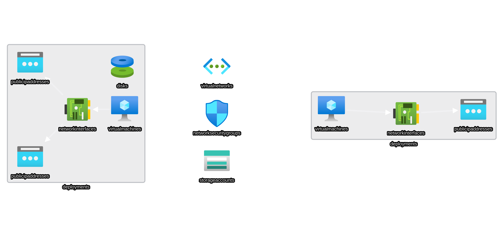

# Infrastructure Deployment

On this folder contain ARM template for infrastructure deployment for this project, deployment covers two target servers and one Load server.

## Target Servers (17ccServers)
Target servers contain 2 VM on azure for testing web app running under docker and web app running under qemu.

The target servers will be deploy using linked template consist of 3 json files. The main template called [17ccServers.json](17ccServers.json) this file will create resource that will be shared by both vm such as Storage Accounts, NSG (Network Security Group), and Virtual Network. 17ccServers folder store remaining template for deploying VM.



### 1. [Docker server](17ccServers/17ccDocker.json)
Docker server deployment consist of one Public IP address, one Network Interface, and VM using size Standard_D2s_v3 with 2vCPU, 8Gb of RAM, with osDisk using StandardSSD with LRS for redundancy, the vm also have boot diagnostic turn on using storage account that provision by main template.
### 2. [VM server](17ccServers/17ccDocker.json)
VM server deployment consist of two public ip address required for qemu, a Network Interface where the ip will be assign to, 2 separate disk both using StandardSSD with LRS for redundancy the first one is osDisk where host os will be store and the second one is dataDisk where guest os will be store, provision of dataDisk is separate from the VM itself and then will be attach when the VM is provision. the VM size used is the same as Docker server and boot diagnostic turn on using the same storage account as docker server.

## Load Servers
Load server work as JMeter runner and where test script will be run, the server will be deployed separately from target servers, this server has its own virtual network and NSG, a network interface, and one public ip address, the vm size is Standard_E4_v3 with 4vCPU and 32Gb of ram, and osDisk with StandardSSD and LRS for redundancy the disk size is 30GB.

> You can also deploy Load server on the same vnet as 17ccServers you only have to remove virtual network provisioning section and modify Network interface properties subnet to use subnet from virtual network 17ccServers 
```json
{
            "name": "[concat(parameters('ServerName'), 'NetworkInterfaces')]",
            "type": "Microsoft.Network/networkInterfaces",
            "apiVersion": "2020-11-01",
            "location": "[resourceGroup().location]",
            "dependsOn": [
                "[resourceId('Microsoft.Network/publicIPAddresses', concat(parameters('ServerName'), 'PublicIP'))]",
                "[resourceId('Microsoft.Network/virtualNetworks', concat(resourceGroup().name, 'VirtualNetwork'))]"
            ],
            "tags": {
                "displayName": "[concat(parameters('ServerName'), 'NetworkInterfaces')]"
            },
            "properties": {
                "ipConfigurations": [
                    {
                        "name": "ipConfig1",
                        "properties": {
                            "privateIPAllocationMethod": "Dynamic",
                            "publicIPAddress": {
                                "id": "[resourceId('Microsoft.Network/publicIPAddresses', concat(parameters('ServerName'), 'PublicIP'))]"
                            },
                            "subnet": {
                                "id": "[resourceId('Microsoft.Network/virtualNetworks/subnets', "Your Virtual Network Name", "Your Virtual network Subnet Name")]"
                            }
                            //***Remove the quotation from Vnet name and subnet***// 
                        }
                    }
                ]
            }
        }
```

# Deployment
You can use various method available for deploying arm template such as using portal, CLI, PowerShell, Rest API, Github, Cloud Shell. below is documentation for deploying arm template

* [Deploying via Azure Portal](https://docs.microsoft.com/en-us/azure/azure-resource-manager/templates/deploy-portal)
* [Deploying via CLI](https://docs.microsoft.com/en-us/azure/azure-resource-manager/templates/deploy-cli)
* [Deploying via PowerShell](https://docs.microsoft.com/en-us/azure/azure-resource-manager/templates/deploy-powershell)
* [Deploying via Rest API](https://docs.microsoft.com/en-us/azure/azure-resource-manager/templates/deploy-rest)
* [Deploying via GitHub](https://docs.microsoft.com/en-us/azure/azure-resource-manager/templates/deploy-to-azure-button)
* [Deloying via Cloud Shell](https://docs.microsoft.com/en-us/azure/azure-resource-manager/templates/deploy-cloud-shell)